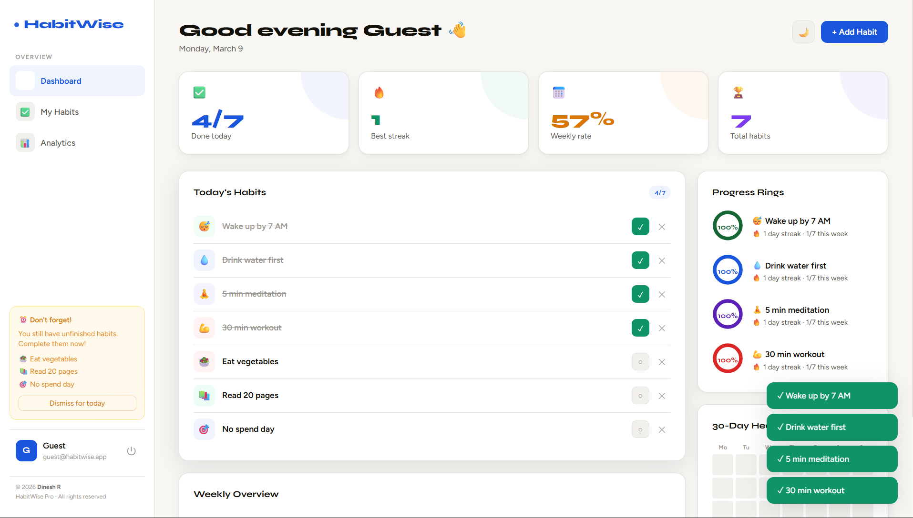
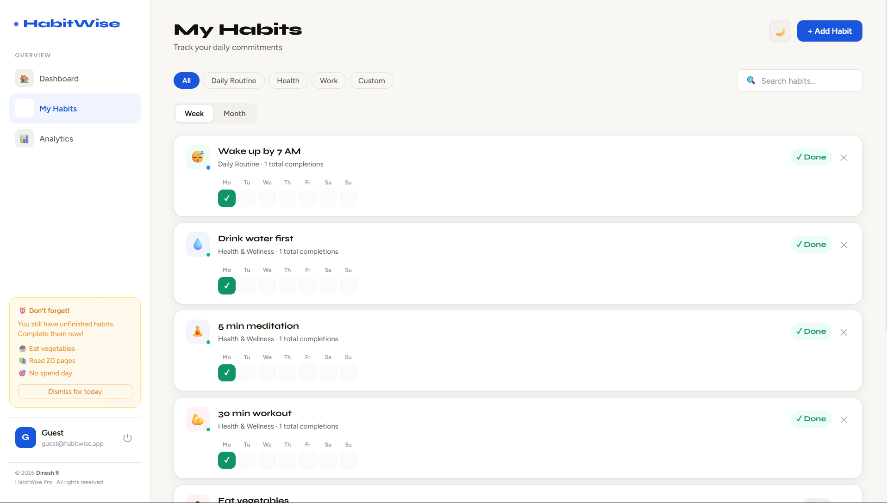
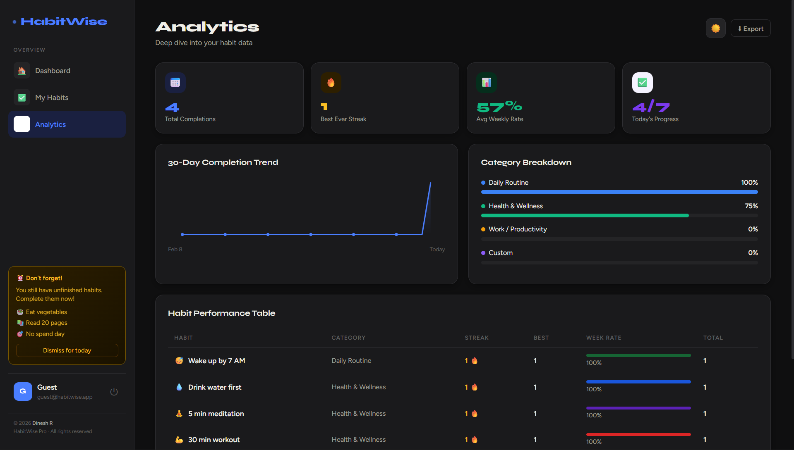

# 🎯 HabitWise Pro

**A professional daily habit tracker with cloud sync, real accounts, and OTP password reset. Works on any device, anywhere.**

🌐 **Live App:** [cheerful-daffodil-97df2e.netlify.app](https://cheerful-daffodil-97df2e.netlify.app)

---

## 📸 Screenshots

---

## ✨ Features

- 🔐 **Real User Accounts** — Sign up, log in, data synced across all your devices
- 🔑 **Forgot Password** — Reset via 6-digit OTP sent to your email
- ☁️ **Cloud Sync** — Your habits are saved to the cloud, never lost
- ☀️ **Dashboard** — KPI cards, progress rings, weekly bar chart, 30-day heatmap
- 💬 **Daily Quote** — A new motivational quote every day
- 🎯 **Habit Goals** — Set a daily target (e.g. 8 glasses, 20 pages) with progress bar
- 🎵 **Sound Effects** — Satisfying chime every time you tick a habit done
- ✅ **Habit Tracking** — Tick only today's habits. Past days auto-show ✗ if missed
- 🔥 **Streak System** — Streaks reset to zero if you miss a day
- ⏰ **Reminder Box** — Notifies you of unfinished habits every day
- 📊 **Analytics** — 30-day trend chart, category breakdown, performance table
- 🌙 **Dark Mode** — Full dark theme, saved per user
- 🔍 **Search & Filter** — Filter by category, search by name
- 📅 **Week & Month View** — Switch between views on every habit card
- 📝 **Notes** — Add a personal note to each habit
- ⬇️ **Export** — Download your data as CSV or open a printable PDF report
- 📱 **Mobile Friendly** — Fully responsive with bottom navigation

---

## 🚀 How to Use

Just go to the live app and create a free account:

👉 [cheerful-daffodil-97df2e.netlify.app](https://cheerful-daffodil-97df2e.netlify.app)

- Works on **any device** — phone, tablet, desktop
- Works on **any browser** — Chrome, Firefox, Safari, Edge
- Your data is **synced to the cloud** — log in from anywhere

---

## 🛠️ Built With

| Technology | Purpose |
|---|---|
| HTML5 / CSS3 / Vanilla JS | Frontend |
| Node.js + Express | Backend API |
| Supabase (PostgreSQL) | Cloud database |
| Resend | OTP email delivery |
| Render | Backend hosting |
| Netlify | Frontend hosting |
| JSON Web Tokens | Secure authentication |
| bcryptjs | Password hashing |

---

## 🔐 How Login & Security Works

- Passwords are **hashed with bcrypt** — never stored in plain text
- Sessions use **JWT tokens** — expire after 30 days
- Password reset uses a **6-digit OTP** sent to your email — expires in 10 minutes
- All API endpoints are **rate limited** to prevent abuse
- Data is stored securely in **Supabase PostgreSQL** with Row Level Security

---

## 📤 Exporting Your Data

Inside the app → **Analytics** page → click **⬇ Export**

- **CSV** — Opens in Excel or Google Sheets
- **PDF Report** — Printable summary of all your habits and stats

---

## 🙋 FAQ

**Can I use this on my phone?**
Yes! Fully responsive with a mobile bottom navigation bar.

**Will my data be lost if I clear my browser?**
No — your data is stored in the cloud. Just log back in from any device.

**Can I use it on multiple devices?**
Yes — log in from any device and your habits sync automatically.

**Is my data private?**
Yes — each account is private and secured with encrypted passwords.

---

## 📜 License & Ownership

© 2026 **DineshR-45**. All rights reserved.

This project was designed and built by **DineshR-45**.
Viewing the source code is permitted for learning purposes.
Reselling or republishing this project without permission is not allowed.

---

## 📬 Contact

Have questions or want to collaborate?
Find me on GitHub: [@DineshR-45](https://github.com/DineshR-45)

---

*Made with ☕ and consistency.*

